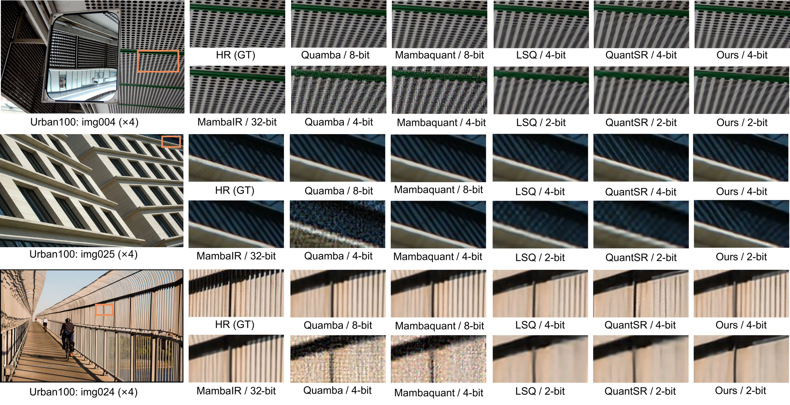

# Q-MambaIR: Accurate Quantized Mamba for Efficient Image Restoration

> **Q-MambaIR: Accurate Quantized Mamba for Efficient Image Restoration**
> [arXiv 2503.21970](https://arxiv.org/abs/2503.21970)

<p align="center">
  
</p>

## Overview

Q-MambaIR proposes two complementary techniques for quantizing Mamba-based image restoration networks:

- **DLS (Dynamic-balancing Learnable Scalar)** — an input-adaptive learnable scalar that dynamically adjusts the quantization mapping range to mitigate errors caused by extreme activation values.
- **RFA (Range-floating Flexible Allocator)** — an adaptive thresholding strategy for weight quantization that preserves fine image details while maintaining the model's feature extraction capacity.

Together, DLS and RFA enable accurate 4-bit (and lower) quantization of MambaIR backbones for image super-resolution and denoising tasks, achieving competitive PSNR/SSIM with significantly reduced model bitwidth.

## Requirements

```bash
conda env create -f environment.yml
conda activate mambaIR
pip install -e .
```

Key dependencies: `torch==2.0.1`, `mamba-ssm==1.2.0.post1`, `einops`, `timm`.

## Data Preparation

Download the following datasets and update the `dataroot_gt` / `dataroot_lq` fields in the YAML config files accordingly.

**Training:**
- [DF2K](https://data.vision.ee.ethz.ch/cvl/DIV2K/) (DIV2K + Flickr2K)

**Validation / Test (SR):**
- Set5, Set14, B100, Urban100, Manga109

**Validation / Test (Denoising):**
- CBSD68, Kodak24, McMaster, Urban100

Organize them as:

```
/path/to/datasets/
  DF2K/
    HR/
    LR_bicubic/X2/  X3/  X4/
  SR/
    Set5/HR/   Set14/HR/   B100/HR/   Urban100/HR/   Manga109/HR/
    <same>/LR_bicubic/X4/
```

## Pretrained Models

| Model | Task | Bitwidth | Download |
|-------|------|----------|----------|
| Q-MambaIR-Light-x4 (4-bit) | SR ×4 | W4A4 | [Google Drive](https://drive.google.com/file/d/1wz6v4CCOmCjE7Bi-s2LudB7Rtgiz58SW/view?usp=sharing) |

Place downloaded `.pth` files in `/path/to/pretrained_models/` and update `path.pretrain_network_g` in the corresponding YAML.

## Training

### Q-MambaIR Light SR ×4 (4-bit)

```bash
# Single node, 2 GPUs
python -m torch.distributed.launch --nproc_per_node=2 --master_port=2488 \
  basicsr/train.py \
  -opt options/train/Ours/x4/quant_train_bl_lightSR_x4_4b.yml \
  --launcher pytorch
```

On a SLURM cluster, use the provided script:

```bash
sbatch options/train/Ours/x4/QBaseline_x4_4b.sh
```

Edit the `#SBATCH` headers in the script to match your cluster's partition, QoS, and account settings.

## Testing

```bash
python basicsr/test.py -opt options/test/LightSR/ours/test_MambaIR_lightSR_x4_ours_4b.yml
```

## Project Structure

```
Q-MambaIR/
├── basicsr/
│   ├── archs/          # Model architectures (QuantBL_L_MambaIR, etc.)
│   ├── data/           # Dataset loaders
│   ├── losses/         # Loss functions
│   ├── models/         # Training/validation loop
│   ├── train.py        # Training entry point
│   └── test.py         # Testing entry point
├── options/
│   ├── train/Ours/     # Q-MambaIR training configs
│   └── test/LightSR/   # Q-MambaIR testing configs
├── environment.yml
└── requirements.txt
```

## Citation

If you find this work useful, please cite:

```bibtex
@article{qmambair2025,
  title   = {Q-MambaIR: Accurate Quantized Mamba for Efficient Image Restoration},
  author  = {Yujie Chen and Haotong Qin and Zhang Zhang and Michele Magno and Luca Benini and Yawei Li},
  journal = {arXiv preprint arXiv:2503.21970},
  year    = {2025}
}
```

## Acknowledgements

This codebase builds on [MambaIR](https://github.com/csguoh/MambaIR) and [QuantSR](https://github.com/htqin/QuantSR). We thank their authors for releasing the code.

## License

This project is released under the [Apache 2.0 License](LICENSE).
